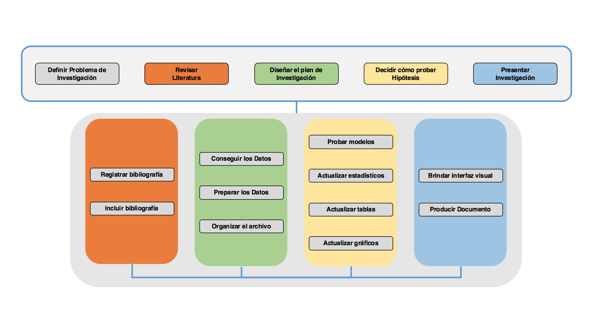

 <h1>Herramientas Computacionales   para la Investigación Interdisciplinaria Reproducible</h1> 

  

* Profesor:  <a href="http://www.pucp.edu.pe/profesor/jose-manuel-magallanes/" target="_blank">Dr. José Manuel Magallanes, PhD</a> ([jmagallanes@pucp.edu.pe](mailto:jmagallanes@pucp.edu.pe)) Profesor del **Departamento de Ciencias Sociales, Pontificia Universidad Católica del Peru**. 
Senior Data Scientist del **eScience Institute** and Visiting Professor at **Evans School of Public Policy and Governance, University of Washington**. 
Fellow Catalyst, **Berkeley Initiative for Transparency in Social Sciences, UC Berkeley**.

## Sesión 1: Modelo de Investigación

  

Este curso plantea apoyarte durante el proceso de investigación interdisciplinaria, es decir, donde  profesionales de diferentes especialidades pueden intervenir. Así mismo, este apoyo radica en brindarte herramientas claves para los diferentes momentos del proceso.

Cada herramienta tiene una función determinada, sin embargo, a lo largo del curso, veremos cómo podemos integrarlas de una manera sencilla.

Para ello, les planteamos que podríamos abstraer el proceso de investigación según lo describe la Figura 1.

Los elementos de la Figura 1 se dividen en dos grupos. En la parte superior figuran los grandes componentes:

* Definición del problema de investigación.
* Revisión de la literatura.
* Diseño del plan de investigación.
* Prueba de hipótesis.
* Publicación de resultados.

No he puesto una secuencia entre estos componentes, pues es evidente que hay una serie de idas y venidas entre estos. En todo caso no es mi intención discutir el orden de éstos, sino más bien ver qué herramientas podemos utilizar para  automatizar las diversas tareas relacionadas con cada una de ellas. Nótese que a cada componente se le ha asignado un color, y ese mismo color tienen las tareas ahí explicitadas; sin embargo, el hecho de no asignarle tareas al componente de definición de problema de investigación es por que este curso considera que ya sabes qué problema de investigación tienes. 

Así, he designado como automatizables diversas tareas. Y esto lo he decidido pues detrás de cada una hay alguna herramienta computacional que nos puede apoyar:

* Registrar referencias en una base de datos. Esto debe ser de tal manera que permita guardar los meta datos de diversos tipos de *documentos*: libros, revistas, vídeos, etc. 

* Incluir referencias en el documento. Poder hacer referencia cruzada entre la cita y la referencia; así como tener la flexibilidad de mostrar diversos sistemas de referencia (APA, Chicago, IEEE, Vancouver, etc.)

* Conseguir los datos mediante procesos diversos (experimentales y no experimentales), incluyendo procesos de *scrapeado*. Tener en cuenta que los datos inicialmente conseguidos pueden variar, o que con el avance de la investigación suceda que se encuentran mejores proxies.

* Preparar los datos, dándole el formato adecuado para que la técnica prevista sea aplicada. Ello varía si se piensa en modelos transversales, longitudinales, jerárquicos, redes, texto, mapas, entre otros. Esto amerita además procesos de integración de tablas de datos, así como la verificación que los datos sean consistentes con la escala de medida que representan.

* Organizar el archivo, es decir, decidir dónde se guardará los datos, tanto los originales como los procesados; y cómo se accederá a ellos, tanto los colaboradores como quiénes deseen auditar.

* Probar modelos con los datos según la hipótesis planteada, considerando que por diversas razones puedes intentar modelos alternativos (como decidir entre paramétrico y no paramétrico); hasta inclusive la hipótesis puede ser modificada por lo que esta tarea no es necesariamente la planificada. Los modelos son sensibles a los datos, y los datos pueden estar siendo actualizados constantemente.

* Actualizar estadísticos. Si los modelos y la data varían, los estadísticos varían; debemos tener maneras de que ello impacte lo menos posible en el documento en elaboración.

* Actualizar tablas. Igual que en el caso anterior, si los datos y los modelos varían, las tablas producidas inicialmente variarán; hay que evitar que el tiempo de re edición se reduzca.

* Actualizar gráficos. Este es el mismo caso que lo anteriormente mencionado, si los datos y los modelos varían, los gráficos producidas inicialmente variarán; y si son más complejos el costo de re edición aumenta (anotaciones, guías, títulos, paletas, etc.). La herramienta a utilizar debe tener en cuenta esta complejidad.

* Brindar interfaz visual. Por lo general, se tiene la necesidad de visualizar los avances. Muchas veces el asesor o el jefe del proyecto de investigación (o el corrector de estilo) quiere ver parte del trabajo . Esta persona no tiene que saber manejar las herramientas que verán Uds en el curso, sólo quiere ver cómo va el trabajo y preparar correcciones. Una interfaz es necesaria para ello.

* Producir documento. Aquí me refiero al documento final. Por lo general es un único documento pero también puede ser una colección de documentos integrados en uno solo. Hay que tener en cuenta que el *parcial*, que será el *final* es el que se irá visualizando en el interfaz, hasta que te decidas detener y poner el punto final.

Como también se muestra en la Figura 1, estas tareas están interrelacionadas, no se hacen de manera secuencial. Podríamos pensar en diversas relaciones entre ellas, siendo la más compleja la que hay entre el documento final y todas las demás.

Considera además que tantas idas y venidas durante el proceso de investigación nos acercan a cometer diversos errores de fondo y forma, que podrían ser controlados si hacemos uso de herramientas computacionales creadas para ayudar en diversas tareas, asi veremos:

- **Zotero**, para el manejo de las citas. Lo que necesitamos de Zotero es que pueda colectar la metadata de nuestras citas, nos permita editarla si lo necesitamos, y que permita su descarga como un archivo de citas que pueda ser usado en el documento integral. Para usar Zotero, debes crear una cuenta [aquí](https://www.zotero.org/), desde ahí debes descargar el *cliente* para tu computadora.

- **GitHub**, para organizar todos los archivos. GitHub guardará en la nube todo el trabajo, incluyendo datos, códigos, imagenes, citas, documento integrador, y similares. Para usar GitHub, debes crear una cuenta [aquí](https://github.com/), luego descarga el *cliente* para tu computadora en este [enlace](https://desktop.github.com/).

- **R**, En este curso desarrollaremos diversas técnicas en R. Descarga R desde este [enlace](https://cran.r-project.org/). Una vez descargado e instalado, debes instalar RStudio desde [aquí](https://www.rstudio.com/products/rstudio/download/#download). RStudio es una interfaz gráfica para R, y nos servirá para crear nuestros programas y el documento integrador.

- **Latex** servirá para redactar el documento en RStudio. Según seas usuario de Mac o Windows, debes descargarlo desde este [enlace](https://www.latex-project.org/get/). Para los que están usando **Windows**, se recomienda descargar **Miktex**. Al ejecutar el instalador básico recuerda instalar todos los paquetes faltantes, para ello selecciona la opción **yes** en esta ventana:

- **Anaconda** es una suite de aplicaciones para utilizar Python. La instalación de Anaconda facilitará el uso de Python, en particular Jupyter, en donde usaremos markdown para crear documentos tipo blog. Puedes descargarlo desde este [enlace](https://www.anaconda.com/download/).

- **Overleaf 2** sevirá para compartir el documento que salga de RStudio. es simplemente un editor en linea de Latex con varias propiedades interesantes para permitir que un externo lea tu trabajo. Puedes registrarte en este [enlace](https://www.overleaf.com/blog/641-try-out-overleaf-v2).

Instala todo esto en tu máquina, veremos cada una de ellas en este curso, sobre todo R y Python, y además aprenderemos como hacerlas interactuar.

_____

[Volver al curso](https://magallanesjosemanuel.github.io/BITSS_ToolsWorkshop/)

_____

**AUSPICIO**: 

El desarrollo de estos contenidos ha sido posible gracias al grant del Berkeley Initiative for Transparency in the Social Sciences (BITSS) at the Center for Effective Global Action (CEGA) at the University of California, Berkeley

**RECONOCIMIENTO**

<!--
EL Dr. Magallanes agradece a la Pontificia Universidad Católica del Perú, por su apoyo en la elaboración de este trabajo.

-->

El autor reconoce el apoyo que el eScience Institute de la Universidad de Washington le ha brindado desde el 2015 para desarrollar su investigación en Ciencia de Datos.

 
 

